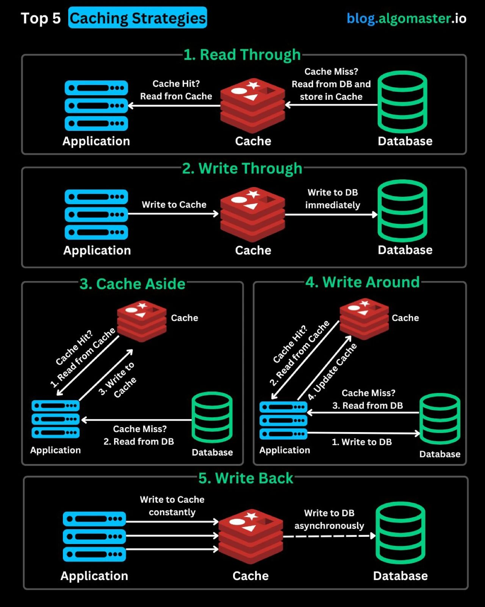

# 缓存策略

## 1. Read Through（读穿）：读数据的“快捷通道”

应用查数据时，先找缓存——
✅ 命中（Cache Hit）：直接从缓存读，秒级响应（像电商查商品详情，缓存有就直接展示）；
✅ 没命中（Cache Miss）：缓存自动从数据库捞数据存起来，下次读就快了！
核心优势：流程简单，应用不用操心“缓存-数据库”同步，适合高频读场景。

## 2. Write Through（写穿）：数据一致性“死磕派”

写数据时，必须缓存和数据库同时更新！
✅ 优点：缓存、数据库100%一致（金融交易、订单系统必备，错一笔都不行）；
✅ 缺点：同步写数据库，会拖慢写操作速度（追求极致性能的场景要掂量）。

## 3. Cache Aside（旁路缓存）：灵活“万金油”

读操作：先查缓存→命中直接用，没命中就去数据库读，再把数据丢回缓存（下次读更快）；
写操作：直接写数据库，再让缓存失效/更新（保证数据库是“权威数据源”，避免脏数据）。
典型场景：Web应用存用户信息，读优先走缓存提速，写操作确保数据准。

## 4. Write Around（绕写）：写操作“减负神器”

写数据时，直接跳过缓存，只写数据库！
读数据时：缓存有就直接读，没命中再从数据库捞，顺道更新缓存。
适合场景：写多、读不着急的场景（比如日志系统，大量日志先丢数据库，读的时候再同步缓存，减少写缓存的开销）。

## 5. Write Back（回写）：高性能“风险玩家”

写数据时，只更新缓存，异步批量写数据库！
✅ 优点：写操作秒级完成，吞吐量爆炸（高并发消息队列常用，大量消息先存缓存，再慢慢同步数据库）；
✅ 风险：缓存挂了，没同步到数据库的数据会丢！（得搭配容灾方案）

## 6. 策略选择
• 高频读、想简化流程 → Read Through
• 数据一致性必须死磕 → Write Through
• 读写都想灵活控 → Cache Aside
• 写多、读不着急 → Write Around
• 追求极致写性能、能接受小风险 → Write Back
